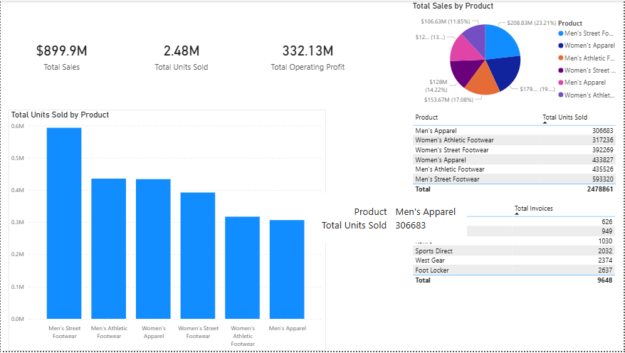

# Adidas US Retail Sales Performance Dashboard

## Project Overview
This project features a two-page interactive Power BI dashboard designed to analyze $899.9M in Adidas US sales data. The core objective of this analysis is to transform raw, unorganized transactional data into actionable executive insights, identifying key revenue drivers, regional performance trends, and sales channel efficiencies across the United States between 2020 and 2021.

## Live Dashboard Preview
*Replace these placeholders with the paths to your screenshot images in your repository folder*

### Page 1: Product & Retailer Analytics


### Page 2: Regional Performance & Executive Overview


---

## Key Business Insights
*   **High-Level Performance:** Total sales reached **$899.90M** with a healthy cumulative operating profit of **$332.13M** and a **36.9%** average operating margin.
*   **Top Revenue Driver:** **Men's Street Footwear** outpaced all other product categories, generating **$208.83M** (23.21% of total sales volume).
*   **Regional Stronghold:** The **West Region** proved to be the most lucrative market, leading the country in both total sales and total units sold.
*   **Retailer Efficiency:** **West Gear** and **Foot Locker** emerged as the primary retail partners, driving a significant portion of total transaction values.

---

## Technical Architecture & Core Milestones

### 1. Data Cleaning & ETL (Power Query)
*   **Structural Optimization:** Cleared irregular multi-row metadata and empty headers from the raw spreadsheet to establish a clean, standard tabular format.
*   **Data Type Integrity:** Verified proper data type assignments, ensuring dates, whole numbers for units sold, and decimal monetary values were parsed correctly.
*   **Redundancy Removal:** Stripped null columns (`Unnamed: 0`) to optimize memory performance within the internal data model.

### 2. Data Modeling & DAX Development
*   **Star Schema Architecture:** Separated transactional facts from dimension tables, ensuring high-performance cross-filtering.
*   **Explicit Calculations:** Moved away from default implicit column aggregations to author bulletproof DAX measures, handling complex non-additive metrics like **Operating Margin %** cleanly:
```DAX
    Operating Margin % = DIVIDE(SUM('Adidas Sales'[Operating Profit]), SUM('Adidas Sales'[Total Sales]), 0)
    ```
*   **Precision Control:** Configured explicit display formatting on KPI units (e.g., forcing `2.48M` units instead of heavily rounded values) to ensure reporting precision.

### 3. UI/UX Design & Dashboard Polish
*   **Executive Scannability:** Integrated a standardized KPI sidebar across both dashboard pages to provide immediate business context to viewers.
*   **Clutter Reduction:** Toggled off redundant axis titles on high-level charts where the visual headers and categorical labels made the charts self-explanatory.
*   **Localization Optimization:** Configured English (United States) locale settings to align comma grouping and dollar formatting cleanly with the US regional scope of the dataset.

---

## Repository Structure
```text
├── Data/
│   └── Adidas US Sales Datasets.xlsx      <-- Raw Excel data file
├── Reports/
│   └── Adidas_US_Sales_Dashboard.pbix     <-- Final Power BI Report file
├── Images/
│   ├── Product_Analysis.png                   <-- Page 1 Screenshot
│   └── Regional_Analysis.png                   <-- Page 2 Screenshot
└── README.md                              <-- Project documentation
